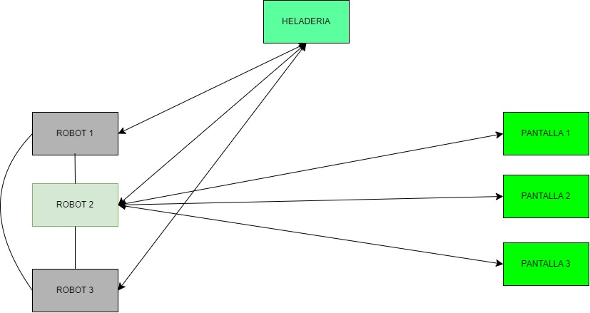
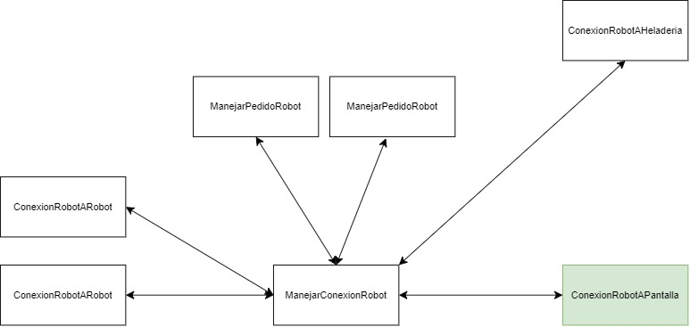
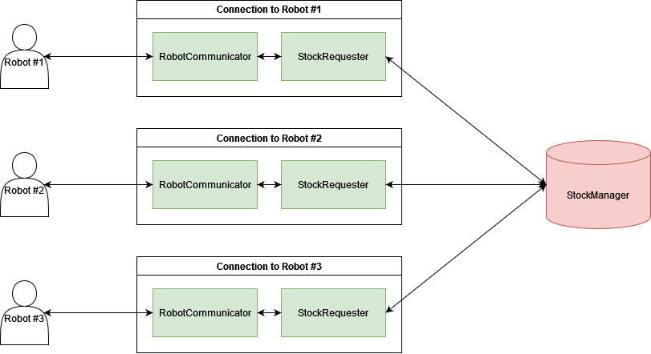
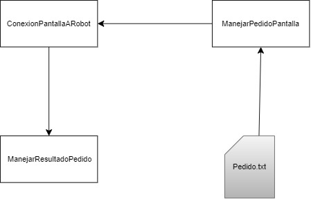
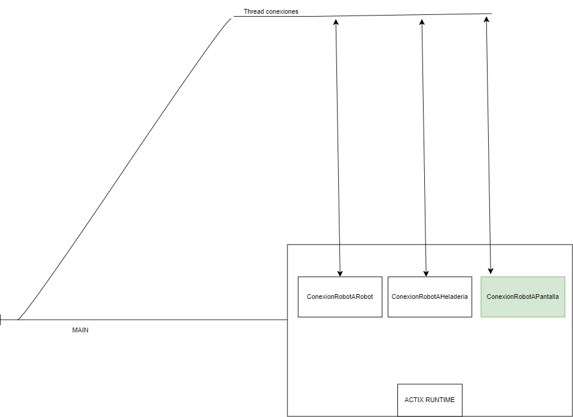

# Pedidos y Robots: Sistema de Gestión de Helados

<p align="center">
    
</p>

| Alumno           | Padron |
| ---------------- | ------ |
| Pujato, Iñaki    | 109131 |
| Bohorquez, Ruben | 109442 |
| Belforte, Paolo  | 109432 |

[Link al video de presentación](https://youtu.be/hIp647Pe6HM)

## Arquitectura general

La arquitectura del sistema se va a componer de 3 tipos de procesos distintos, estos siendo multiples `Robots`, que estaran conectados a una `Heladeria`, y multiples `Pantallas` que usaran los clientes para realizar sus pedidos.

<p align="center">
    
</p>

Los procesos de `Robots` reciben los pedidos de los clientes a traves de un Socket TCP, donde un Robot lider se encargara de recibir todas las conexiones y enviar los pedidos. Si el Robot lider falla, se va a poder elegir otro como lider a traves de un algoritmo de eleccion, los `Robots` estaran conectados entre todos.

Los procesos de `Pantallas` envian pedidos al Robot lider para ser atendidos y recibir un mensaje de exito o de fallo dependiendo si se pudo completar la transaccion del pedido o no.

La `Heladeria` se conectara con todos los `Robots` y mantendra el stock de helados para un momento dado, por lo que cada Robot le pedira a la `Heladeria` si tiene la cantidad de un helado especifico para usar y le enviara un mensaje de confirmacion. El stock de helados se guarda con un HashMap de la forma GustoHelado: Mutex<CantidadHelado>. Para cubrirse ante los fallos, la heladería hará un backup de su stock a un archivo cada cierta cantidad de órdenes.


## Estructuras interna

### Robots
Contara con los siguientes actores para procesar los pedidos

* `ConexionRobotARobot` se encarga de manejar las comunicaciones por sockets entre los demas `Robots`
* `ConexionRobotAHeladeria` se encarga de las comunciones por sockets entre el Robot y la Heladeria, envia y recibe mensajes para controlar si hay helado de cierto tipo o no
* `ManejarConexionRobot` su objetivo es recibir datos de distintos actores y enviarlo a otros actores que lo necesiten, tambien se encarga de elegir un lider si es necesario  y procesa los pedidos
* `ConexionRobotAPantalla` el lider en particular contara con estos actores que recibiran los pedidos de las `Pantallas` y enviara los resultados a los mismos

<p align="center">
    
</p>


### Heladeria
Se encarga de controlar el acceso de todos los robots al stock de helado. En esencia, es una base de datos que utilizan los robots para manejar y compartir el stock. Cuenta con los siguientes actores:

* `StockManager`: controla los stocks de helado y el acceso a los mismos de forma concurrente.
* `StockRequester`: se encarda de hacer las solicitudes respectivas al `StockManager` en nombre del robot y transmitirle los resultados de los pedidos
* `RobotCommunicator`: mediador entre el `StockRequester` y el robot a través de un socket

<p align="center">
    
</p>

### Pantallas
Estara implementado con estos actores
* `ConexionPantallaARobot` envia y recibe peticiones a los `Robots` a traves de sockets
* `ManejarPedidoPantalla` recibe las ordenes a traves de un archivo y las convierte a un formato deseable
* `ManejarResultadoPedido` decide que realizar si el resultado del pedido es un fallo o no

<p align="center">
    
</p>

## Diagramas de threads

Particularmente, creemos que el diagrama de threads mas interesante es el de los `Robots`, siendo el siguiente

<p align="center">
    
</p>

Donde las conexiones se reciben a traves de un thread listener que recibira las conexiones de los sockets


## Ejecucion

A partir del directorio raiz, se deben ejecutar desde terminal

### Pantallas

```bash
cargo run -p screen -- <filename>
```

* Donde filename es un archivo que se encuentre en data/orders para simular los pedidos. Por defecto utiliza `helados.csv`

### Robots

```bash
cargo run -p robot -- <robot_to_robot_listening_port> <robot_to_screen_listening_port>
```

* Los valores para `robot_to_robot_listening_port` se pueden editar en el archivo de constantes del robot. Por defecto puede ser del 10000 al 10009.
* Los valores para `robot_to_screen_listening_port` se pueden editar en el archivo de constantes de la pantalla. Por defecto puede ser del 9000 al 9009.

### Heladeria

```bash
cargo run -p ice-cream-shop -d <debug_level> -i <inventory_file> -b <backup_file_prefix> -f <backup_frequency>
```

* `debug_level`, para elegir el nivel de prints, por defecto es INFO, puede ser uno de los siguientes: [TRACE, DEBUG, INFO, WARN, ERROR, FATAL]
* `inventory_file`, archivo del inventario de la heladeria
* `backup_file_prefix`, prefijo para los archivos de backup que se iran generando
* `backup_frequency`, la cantidad de ordenes a procesar antes de crear un backup
* Adicionalmente, `-h`, muestra un print de ayuda para las opciones

### Comandos

Se puede interactuar con los programas a traves de terminal con sus comandos, se cuenta con la posibilidad de escribir la letra `q` para detenerlos.

Además, la heladería cuenta con la opción de ejecutar un backup manual con la letra `b`.

## Ultimos cambios de diseño
Al empezar con el TP, nos dimos cuenta que se nos hacia mas sencillo que los `Robots` no se encuentren en anillo, si no que esten conectados entre todos y la eleccion se haga con un algoritmo bully, donde se va a elegir el proceso Robot con el numero de puerto mas alto.

La heladeria al ser un punto de fallo, tendra un sistema de backups regularmente, para mantener el estado del stock de helados a traves de commits cada cierto tiempo, por lo que si falla, se puede volver a ejecutar para recuperar la informacion.
Ademas, eliminamos el actor de `ManejarPedidoRobot`, ya que el pago lo trasladamos a las pantallas, y el procesado de pedidos lo maneja el actor de `ManejarConexionRobot`

Para las pantallas, se mantuvo bastante el diseño original. A medida que fue surgiendo la necesidad surgieron nuevos archivos para subdivir la implementacion en objetos o actores con responsabilidades mas definidas. Particularmente destacan dos actores, el `ScreenOrderManager` y `ScreenRobotConnection`. El primero se ocupa de controlar las ordenes de manera global, y el segundo se ocupa de la comunicacion con los robots. En un momento se barajo terciarizar en otro actor que solo se ocupe de enviar y recibir mensajes externos, pero nos parecio finalmente que no valia la pena y se dejo de la forma en que se lo ve hoy. 
